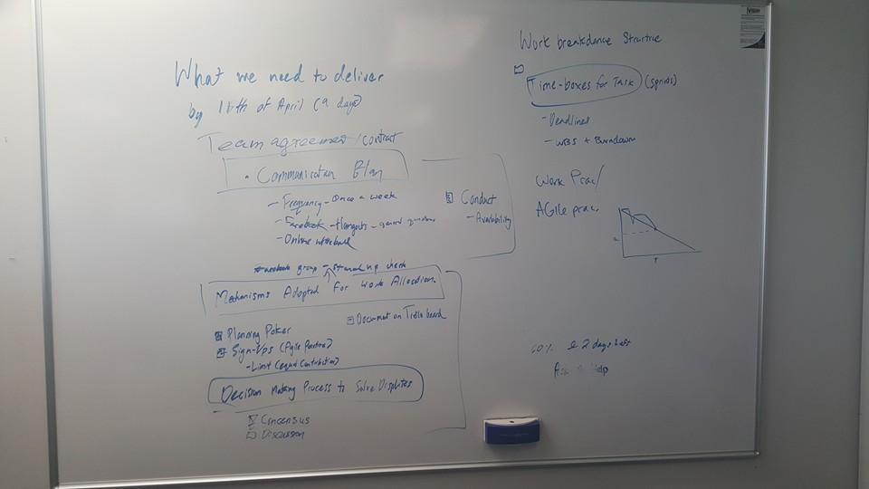
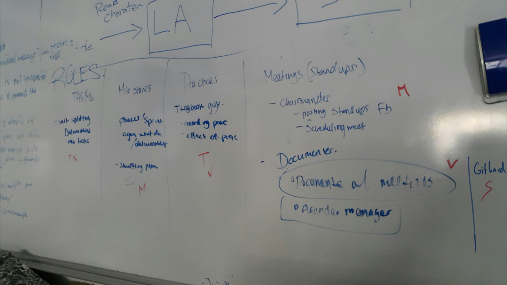
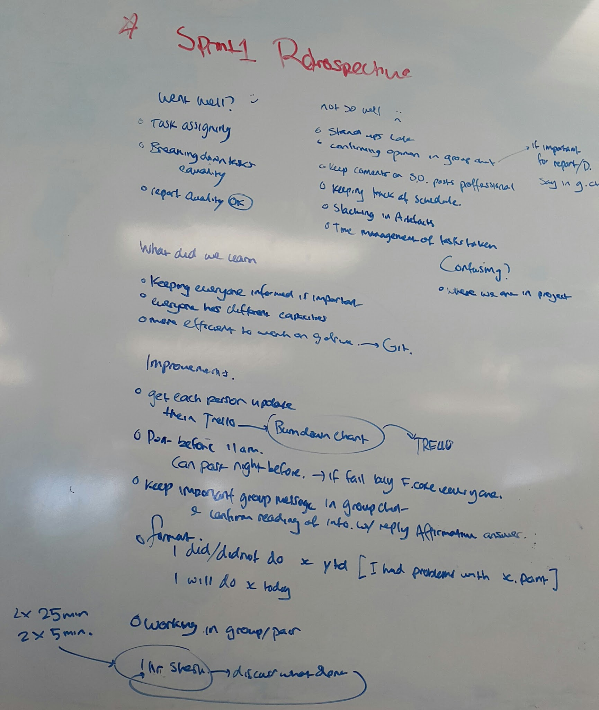
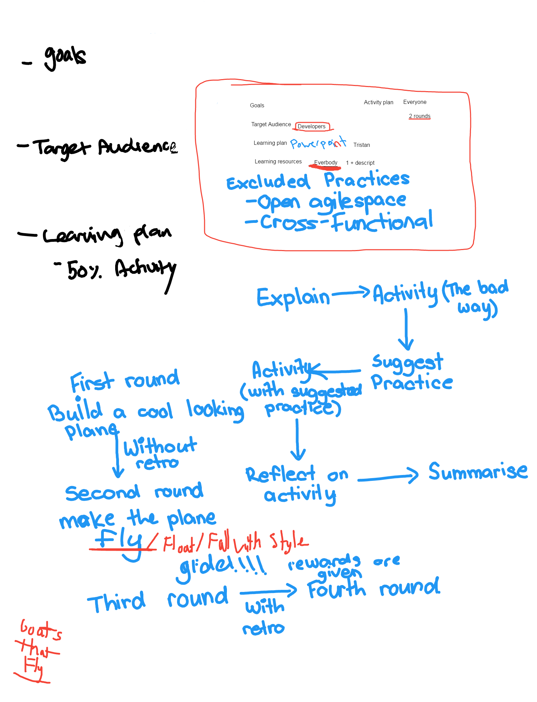
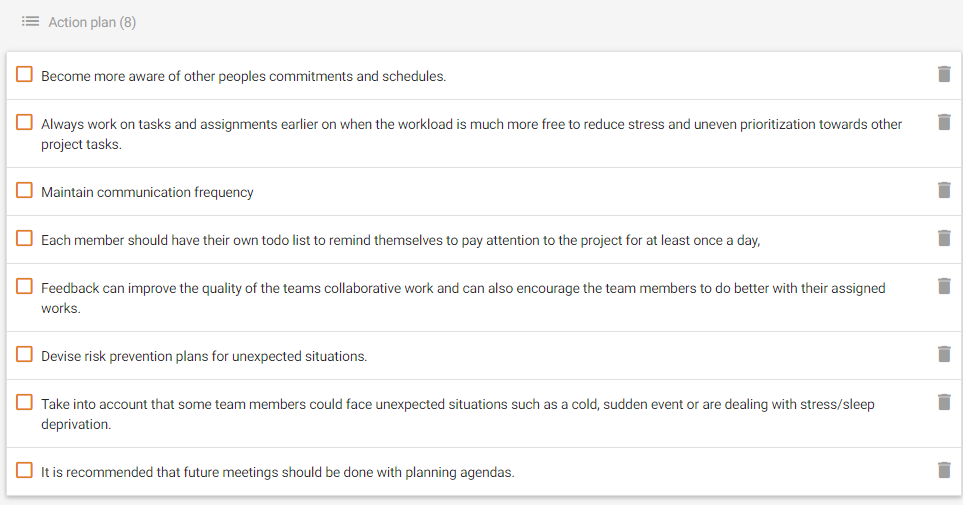
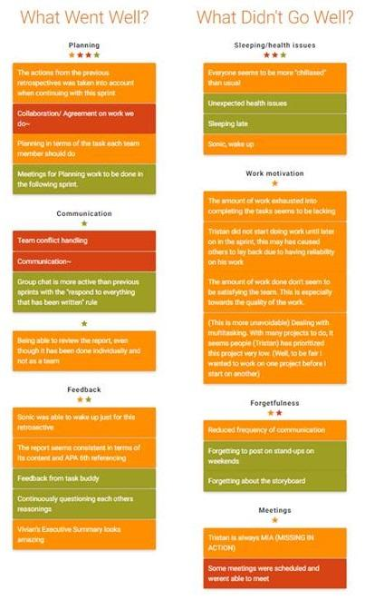

**Kick-Off Meeting - Time:**45mins **Date:** 6/4/16

**Summary:** Discussed what the entire project and also deliverables that will be due by April 15th.

**Team Agreement/Contract:**

-   Communication plan - Conduct - Availability

    -   Frequency - Physical Meetings will be held at least once a week

    -   General Communication - Facebook/Hangouts

    -   Online whiteboard

-   Mechanisms Adopted for work Allocation

    -   Facebook Group - Used for stand-up checks

    -   Document and assign tasks on a Trello storyboard

    -   Planning poker

    -   Sign-ups (Agile practice)

        -   Limit (Equal contribution)

-   Decision making process to solve disputes

    -   Consensus 

    -   Discussion

-   Work breakdown Structure

    -   Time boxing tasks

    -   Deadlines

-   Practice

    -   Agile practice

    -   Will include burndown chart

-   Time left

    -   52 days left (From Wednesday 6th April onwards)

**Meeting 1 - Time:** 40mins **Date:** 12/4/16

**Summary:** Deciding roles to be assigned with practices.

**The following tasks have been assigned members:**

-   **Tasks **

    -   Task Managers - In charge of splitting deliverables and managing Trello board

        -   Tristan

        -   Sonic (Nitiwat)

    -   GitLord - Manages Git pull requests and general branch management

        -   Sonic

-   **Milestones**

    -   Milestone Schedulers - Manages Sprints/Phases, Agenda, Deliverables. Plan will be shuffled around if needed

        -   Sonic

        -   Tristan

-   **Practices **

    -   Practice Documenter - Deals with and records practices including the effect on the group and updating the wiki page.

        -   Miguel

        -   Vivian

-   **Meetings (Standups)**

    -   Chairman/Commander - Facilitates Stand-ups and other meetings

        -   Miguel

    -   Documenter Records everything that occurs in a meeting. Agenda manager.

        -   Vivian

**Time left** - 45 days left (From Wednesday 12th April onwards)

**Meeting 2 - Time: 60mins Date:** 13/04/16

**Summary:** Discussed effort estimation with planning poker based on 1-10 where 10 represents the most effort

**In TOTAL 12 user stories**

-   Select case study - 1

    -   Quick agreement

-   Team agreement - 2

    -   Quick agreement

-   WBS - 5

    -   Simple misunderstanding with effort estimation

-   Work approach - 4

    -   Constant switching between 4 and 5.

    -   Miguel - has experience from reading the agile practice SE assignment paper and can share his knowledge so the amount of study regarding the approach we will not be so difficult.

-   Recommendation Report document - 8

    -   Taking consideration of the why, how and what to work on this wiki.

    -   Constant discussion regarding the amount of work this document will contain.

    -   Decided to recommend three approaches. Discussed suitability of approaches and what they cater to.

    -   Votes consisted from 4-9

-   Recommending - 3

    -   Part of the recommendation report - The act of recommending the practice where research has already been done therefore effort should have mainly been put in the recommendation studies

-   Tools recommendation - 2

    -   Quick agreement

-   Learning packages - 7

    -   Package to upskill a team. Team realised how much effort it will take to do this.

    -   Range of 4-8

-   Evidence of development process - 3

    -   Will be ongoing throughout the project. Quick agreement

-   Team Retrospective - 2

    -   Whole team discusses opinions based on what happened in the project

-   Individual Retrospectives - 2

    -   Every individual will give their own opinions based on what happened in the project

-   Executive Summary - 3

    -   Presentation slide/Poster. Quick Agreement

**Time left** - 44 days left (From Wednesday 12th April onwards)

**Meeting 3 - Time:** 1hr 30 mins **Date:** 19/04/16

**Summary:** Divide workload between team members while managing Trello storyboard

-   Discussed how the case study team in nz is more agile in Vancouver and Vietnam who use more specific development processes (probably waterfall)

    -   They want to create software product so want to update frequently and therefore it is good to recommend Agile

    -   Practices to assign for Viet and Vancouver team

-   Sprint 1 - Introduction to our case study project and choosing project approaches to recommended

-   Will use project papers from previous assignment for this assignment

    -   Make headings into tasks to explain the Agile methodology

    -   Agile practices paper will help a lot

    -   Reference it and it’s sub-references

-   List tools to recommend from Agile

    -   Drafted in a document on google drive and assigned tasks to each team member.

    -   Decided the workload based on schedules of each team member

-   Assign trello tasks

    -   Product backlog and sprint log tasks made on Trello

**Assigned tasks**

Tristan - Maintaining significant documentations

-   Breaking down WBS into User stories

Miguel - Facilitated Knowledge Sharing

-   Case study intro

Vivian - Effective coordination, with less overhead

-   Proof reading/ quality assurance

Sonic - Increased visibility of other teams and entire

-   Possibility increased productivity

**Meeting 4 - Time:** 40mins **Date:** 27/04/2016

**Team retrospective**

-   What went well?

    -   Task Assigning

    -   Breaking down tasks

    -   Report quality

-   Not so well?

    -   Standups are late

    -   Confirming opinions in group chat

    -   Keep comments in standup within the group professional

    -   Lack of schedule keeping

    -   Time management of tasks taken

-   What did we learn?

    -   Keeping everyone informed is important

    -   Everyone has different capacities

    -   Better to work on drive before updating on git for real time collaboration

-   Confusing?

    -   Where we are in project

-   Improvements?

    -   Assign each individual to update burndown chart when they finish their tasks

    -   Allow standups to be posted the night before but must be before 11am

        -   Late standups = frozen coke for everyone

    -   Keep important group messages in group chat and confirm meeting of info

        -   Must write a reply no matter how informal.

    -   Format for standups

        -   I did or didn’t do X yesterday. \[I had problems with X.point\]

        -   I will do X today.

    -   Working in pairs (1hr sessions - Time boxed using Pomodoro timer)

**Meeting 5 Meeting minutes: approx. 2hrs 13/05/16**

**Retrospective meeting**

-   Using the site ‘retrium’ to do our retrospective meeting

    -   Everybody writes their statements on

        -   What to start

        -   What to continue

        -   What to stop

    -   Going more in depth with these statements and writing an action plan

-   Decided to have another voice call meeting tomorrow to decide work allocation and more about the assignment in general

**Meeting 6 Meeting minutes: approx. 1hr 14/05/16**

-   

**Discussion of learning package and how we will construct it**

Goals, target audience, learning plan and resources, learning activity.

-   Want to use the practice - retrospectives

-   Decided on activity where there would be 4 rounds, 2 dif projects which are 2 rounds each

-   One will have a retrospective, one without - Seeing how effective that will be

**Main learning package inclusions/requirements**

Goals

-   Description of the goal of the learning package

Learning resources

-   Get one resource each + description

Learning plan

-   Will be discussed about later on

Learning activity

-   4 one hour sessions

-   Will be discussed in detail later on

Action items

-   Create practice package collaboratively

-   Hold another meeting on monday about learning activity specifics

**Goals for now:**

Research and add references to for the learning package.

**Meeting 7 Meeting minutes: 1hr 30mins 17/05/16**

**Report and Presentation**

Images for report

-   Compare and contrast

Executive summary presentation

-   Includes infographic

-   Pros and cons of lean and scrum

    -   Evidence on pros

    -   Has to be convincing

        -   Sound

        -   Reasoning

        -   Evidence

**Learning package**

-   2 activities

-   Explanation/theory after activities have been done

-   Extra reading

-   Flow of package

    -   Activity

    -   Explain response

    -   Activity with practice

    -   Reflection

    -   Extra reading and evidence

-   First Activity

    -   Includes a ping pong ball and a tarpaulin

    -   Both teams fight to win

    -   Teams aim to get the ping pong ball over to the other team's side

    -   No communication beforehand

    -   Eventually add more balls to the session

    -   Number of rounds depend on the time given

-   Introduce the ideas of retrospectives

-   Second Activity

    -   Ping pong ball and bat

    -   Pass the ball from one bat to another

        -   Ball can not be hit consecutively by an individual

        -   Entire team must hit the ball

        -   Time it

        -   Eventually add a ping pong ball to the session

        -   Retrospective to reflect first round

**Action Items**

-   Planning learning package and presentation

-   Working together on Learning package

-   Working together on Presentation

<!-- -->

-   Activities on Powerpoint - Sonic

-   Images for report - Miguel

-   Executive Summary - Vivian Miguel

-   Description, Reasoning of learning package - Tristan

-   Extra Readings and Evidence - Tristan

**Meeting 8 (Final) 11:18pm - 12:00am (40mins) 24/05/16**

**Final team retrospective on Retrium. **

Reviewed a “What went well, What didn’t go well” type retrospective together with the team.

Based on the opinions and reflective comments in the session, a list of action plan was made to use as a guide or tips for future projects that we will work on.

