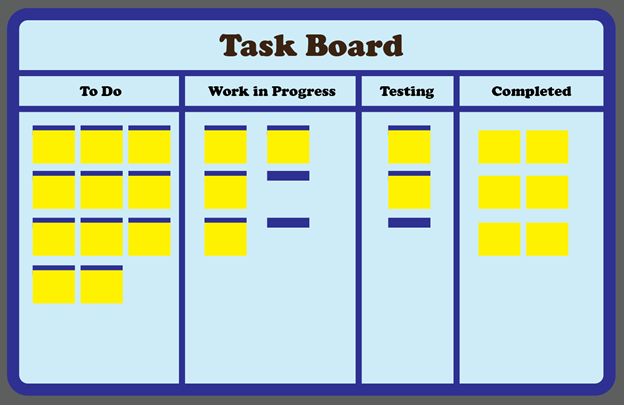
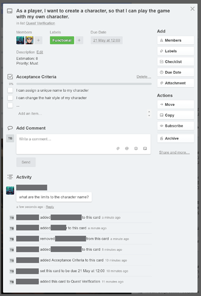
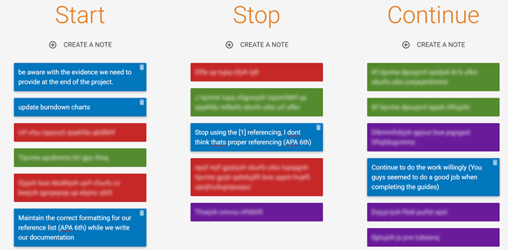

Project Practice Guide
Software Engineering – Assignment 1B

Collaboration and Communication
===============================
Introduction
============
There are many computer-based software engineering tools that can be used as a virtual representation of some scrum tools. Many have integrated these functions as part of their project management software [PMS], but Trello is a suitable example for a collaborative representation of most agile artefacts. 

Although Trello can be a suitable PMS for such approaches as lean, it lacks the support of some practices that construct the framework of SCRUM. In order to compensate for this missing area, the integration of another software or tool maybe be necessary.

Agile Artefacts
===============
There are many artefacts that are included in the agile methodology. The lean approach, in specific, can utilizes a Kanban task board to assist agile teams to manage their tasks.
Task Board: A task board enlists multiple tasks that are to be undertook by the project team. The agile team uses this tasks to visualize the progress of developing/completing their product or service.
Tasks are organized into categories that describe the tasks in terms of its progress. The image below shows a standard list of categories, listing some tasks. The categories depend on the project team, but the names of these categories should give clarity in terms of the progress of a task.
 
Trello
======
Trello is a task manager that can also be used as a project management software. They provide a simplistic way for their users to manage tasks into a task board. Features have been integrated together in order for Trello to simulate a virtual task board. The following features are appropriate to assist agile teams to manage their tasks of their project.
Task boards: A series of task lists that collectively make a task board. The task lists will enlist a collection of tasks that are being managed by the user(s).
Cards: A feature that represents a single task. These are placed within a task list by the user and can describe a task or idea in detail.
The features listed above are appropriate for project management because it simulates a virtual task board. Similar to its physical counterpart, the concept of task boards has been implemented in Trello to imitate a task board as seen in agile projects.

Daily Meetings
==============
Daily meetings are regular meetings that are held by the project team. However, with many factors in arranging face-to-face meetings, these meetings become a hassle. “Nowadays, it is very common for teams to be geographically dispersed” (Sharma & Gundlach, 2013). With the continuous development of technology, there are many tools to compensate for distributed project teams. A suitable example for an online meeting conference tool is the Citrix GoToMeeting tool.

Though it may not be necessary for the New Zealand project team in phase A to implement a web conference tool, the consideration of using such tools for conferences between the three teams from New Zealand, Vietnam and Vancouver for relaying information sharing on what they have done also presenting the proof of concept model.

###Citrix GoToMeeting
Citrix GoToMeeting is a web conference software made to arrange meetings between the project team through the internet. The Citrix GoToMeeting (Citrix System Inc. n.d.) makes it easy to always be included in meetings, even when you are not there in person. This means making meetings can be done without the need for face-to-face interaction between the project team. Citrix GoToMeeting includes a set of features that can assist the project team to simulate a meeting as how you might do in person (Citrix System Inc., n.d.).

####Personal meeting room: 
Attendees can arrange instant or scheduled meeting sessions with others in a personal meeting room.
####Desktop/application sharing: 
attendees can broadcast their screen or an application to other attendees within the meeting session.
####Drawing tools: 
Similar to a whiteboard, individuals are presented with drawing tools within the software, giving them the ability to share ideas on their screens during the meeting.
####HDFaces video conferencing: 
Meeting sessions can be broadcasted to a total of 6 attendees.
####Hand over control:
Passing an attendee the privilege to take control of what is being shared on screen. This feature is useful for another practice: Empowerment (See Empowerment Section).
####Recording:
Meeting sessions can be recorded and shared to others for clarity of discussions that had occurred during the meeting.

Open Agile Office Space
=======================
The open agile office space is a practice that is done in a physical environment. Though there aren’t any tools to support this practice.

In some cases, an agile team will be geographically dispersed (Singleton, 2013). Hence, the practice of an open agile office space contradicts this fact. This can include our case study, should they choose to work independently at different areas of New Zealand. We can also take into consideration the distribution of teams across the world: Vietnam and Vancouver. The agile team will need to form methods to compensate to the large decrease in communication when working in different locations. Social networking tools can support a dispersed agile team by providing the necessities for open communication.
 
####Facebook Messenger
A commonly used social networking tool that can accommodate to open communication is Facebook Messenger. As a secondary to Facebook’s core business (Gans, 2016), accessibility and registration is made simpler, or rather these have already been done. As Facebook has 1.65 million monthly active users (Facebook Inc, 2016), it can be safe to assume majority of device users will have a Facebook account. With these accounts, people can sign in to Facebook Messenger with ease (Eddy, 2015).

Facebook Messenger provides features appropriate for conveying messages between two individuals via private messaging or by broadcasting to multiple users.

####Text: 
Individuals are able to send text messages to other users from their ‘friend list’. They are also given a notification to show whether these messages have been delivered or seen by the other user.
####Voice and video calls: 
Messages can also be conveyed through voice or video calls between two users.
####Photo and videos:
Photos and videos can be sent to other users to view.
####Voice messages: 
Voice messages can be recorded and sent instantly.
####Groups:
Individuals can choose to create a group chat to broadcast their messages to multiple users.

Cross Functioning Teams
=======================
A project team in general can be difficult to manage if the team is cross functional (Mind Tools Editorial Team, n.d.). There are many methods to prevent the difficulty of managing cross functioning teams. Adopting the right approach to motivation is an example. Despite the difference in skills, individuals should have knowledge of their performance as a member of the cross-functional team (Mind Tools Editorial Team, n.d.).

Tools such as Trello can be used to organized the team based on their skills. With the implementation of ‘cards’, individuals can be assigned to multiple cards, often representing a task. For example, a developer can be assigned a task to develop a chat feature for a project management system. This feature can be tested by a tester once development has been passed for verification.

Requirements Engineering
========================
####User Story Creation
In SCRUM practices, user stories should be captured and listed within a product backlog. Trello can be a tool to capture these user stories in a virtual Kanban board. The ‘card’ feature from Trello can be used to describe a user stories. Each card can have information that can describe attributes of the user stories. These are as follows:

####Card name:
The identification of the user story. If the project team follows the standard user story format: As a <role>, I want <something> so that <benefit>.
####Description:
Further description of the user story. This can specify the effort estimation, priority and other information about the user story.
####Labels:
A feature that can categories the user story.
####Checklist:
A list of attributes that can be checked once a certain condition has been met. One way to use Checklists is to include Acceptance Testing for a user story. Once the acceptance test has been met, the team can check it off the checklist.
####Members:
A list of individuals that will be developing or is responsible with a specific user story.
####Due Date: 
The time that a specific user story should be completed. In SCRUM, by default, a user story should be due at the end of the sprint.
####Attachment:
Any files that are related to the user story.
####Activity:
The history of the card in terms of the activities involved with that card.
####Comments:
Comments can be made from the project team to inform others about their insight of a specific user story.

Image 1. shows what a card’s format may be set as. Depending on the project team, the information within each card can vary as Trello provide flexibility for describing user stories in a specific card.
	

Image 1. Card from Trello

Project Planning and Progress Tracking
======================================
####Information Radiators
The information radiators can be used through trello and will be most effective if the teams are apart and not working in an office space, otherwise a physical board will be better as it will be more efficient to always view the board and not going on a website to view it.
This will be helpful to the project as there are 2 developing teams working on the software and will be hard to keep a visible view on the project as it is being passed to the other side of the earth each day. Trello will be accessible from anywhere at any time compared to a physical board where it is in a fixed area and cannot be edited from a different location.
####Iteration Planning and Incremental Development
Iteration Planning can be done without a tool on the other hand trello’s user interface assists the team in iteration planning and incremental development, as you are able to add cards as user stories and then this will be fitted into a sprint. Once the sprint is near end the cards will be put in a “done” section ending the sprint, adding more features will be added to the backlog section of the trello board and implemented into a sprint. 
Change Management
=================
####Empowerment
Empowerment is not a practice that can be assisted by tools, but tools can reflect the effectiveness of this practice within a project team. Trello follows the concept of enabling individuals to undertake tasks of their choice. This is done by giving each member the authority to assign themselves to a specific card. By assigning themselves to a card, the individual has a responsibility to implement the user story that has been described by the card.

Image 2. Individuals can assign themselves to a card.

Quality Assurance
=================
###3Demonstration
Through Citrix GoToMeeting you are able to schedule a meeting with the product owner and stakeholders to demonstrate the product to them through a meeting, citrix will remove the problem of the product owner and stakeholders location not able to be in an actual meeting as they may live too far to attend a face to face meeting. The meeting is also recorded which means the teams are able to go back to watch the meeting and gather all the feedback that are necessary for the iterative planning.
###3Test Driven Development
Trello can assist test making by having multiple acceptance criteria in a card, usually user stories, writing the acceptance criteria assists turning a test code into simple and easy to understand criterias. Once this is done you will have the information to build test units off and once a card acceptance criterias have been completed, the card will marked as completed.
###3Atlassian Bamboo
Atlassian is a powerful testing program and can do many tests in parallel, using this tool will allow team members to not spend time testing on repetitive tests and allows them to focus on the main objective. Atlassian can help test driven development by testing the repetitive tests that are created at the end of the sprint.
####Catch More Bugs:
Automated testing is less likely to let through bugs rather than a human testing it due to exhaustion.
####Agile Development:
Agile projects rely on fast feedback to keep up the speed of agile.
####Test Framework Compatibility:
Test with popular frameworks like JUnit, TestNG, PHP Unit, MS Test, Cpp Unit, N Unit, JMeter, XCode, and GINT.

Retrospectives
==============
Retrospectives should be recorded and referred to in the future. With tools such as Retrium, the project team can easily record their retrospectives online
####Retrium
Retrium is an online retrospective tool that integrates a selection of powerful retrospective techniques (Gonçalves, 2014). These techniques can be chosen by the project team depending on their preference. The following techniques have been implemented into this retrospective tool:

Image 3. Constructing a Start, Stop, and Continue Retrospective with a team

####4Ls:
A factual retrospective technique, highlighting the positives and negatives towards undertaking the project. The four ‘L’s stand for Liked, Learned, Lacked and Longed for.
####Start, Stop, and Continue:
An action based retrospective techniques that focus on the reflecting on the actions the project can consider to improve performance of the team.
####Mad, Sad, and Glad:
An emotional retrospective technique. It encourages the team to think about their emotions towards undertaking the project.

Retrium follows a series of steps to ensure the retrospective is efficient and effective. This applies to all techniques mentioned above for consistency in using the retrospective tool. These steps are:

####Choose a retrospective technique:
With the three techniques present, the project team should choose one technique depending on which will be effective for their current retrospective.
####Explain the chosen retrospective:
Each project team should have an understanding of what the technique contains and the reason for using this technique for their retrospective. This is an optional step to inform those who are unfamiliar with a specific technique.
####Ideation:
A private session where each individual can input the positives and negatives onto sticky notes in the context of their chosen retrospective technique.
####Grouping:
An interactive activity to group common ideas. This encourages involvement from each individual.
####Dot Voting:
With limited amount of votes, each individual is given the opportunity to vote on important ideas. This is an optional step, but gives prioritisation to the main ideas whenever the range of ideas is large.
####Discussion:
Discuss the ideas that has been listed by the team and investigate actions that can be done to improve performance in the future.

References
==========
Atlassian Bamboo (n.d.). Received May 24,2016, from
https://www.atlassian.com/test-automation?_mid=25d08570bc873aeee0e19c8f43d0ff30&aceid=&adposition=1t1&adgroup=10460125007&campaign=179563007&creative=33156430967&device=c&keyword=automated%20testing&matchtype=b&network=g&placement=&gclid=CjwKEAjw1Iq6BRDY_tK-9OjdmBESJABlzoY7UXkOq6PEQemNGB1QiLKO0pmlRDxwKPf83FMhy_9WchoCudDw_wcB

Citrix System, Inc. (n.d.). Features. Received May 10,2016, from http://www.gotomeeting.com/features

Eddy, Max. (2015, December 15). Facebook Messenger (for Android). Retrieved from http://www.pcmag.com/article2/0,2817,2390934,00.asp

Facebook, Inc. (2016, April 27). Facebook Reports First Quarter 2016 Results and Announces Proposal for New Class of Stock. PR Newswire. Retrieved from http://www.prnewswire.com/news-releases/facebook-reports-first-quarter-2016-results-and-announces-proposal-for-new-class-of-stock-300258749.html

Facebook, Inc. (n.d.). Features – Messenger. Received May 10, 2016, from https://www.messenger.com/features

Gans, J. (2016, May 06). Why Facebook Messenger Is a Big Deal for Customer Service. Retrieved from https://hbr.org/2016/05/why-facebook-messenger-is-a-big-deal-for-customer-service

Gonçalves, L. (2014, November 14) 21 Mandatory Tools for Distributed Agile Retrospectives. Retrieved from http://lmsgoncalves.com/2014/11/14/tools-distributed-agile-retrospectives/

Mind Tools Editorial Team, (n.d.) Managing Cross-Functional Teams: Balancing Team Needs and Functional Lines. Retrieved from https://www.mindtools.com/pages/article/newTMM_30.htm
http://www.agilemodeling.com/artifacts/userStory.htm

Sharma, R & Gundlach, M. (2013, March 22). How to Conduct a Daily SCRUM Meeting.
Received from http://www.brighthubpm.com/agile/39653-how-to-conduct-a-daily-scrum-meeting/

Singleton, A. (2013, June 24). Can Agile Work with Geographically Dispersed Teams? Retrieved from https://blog.assembla.com/AssemblaBlog/tabid/12618/bid/99456/Can-Agile-Work-with-Geographically-Dispersed-Teams.aspx

