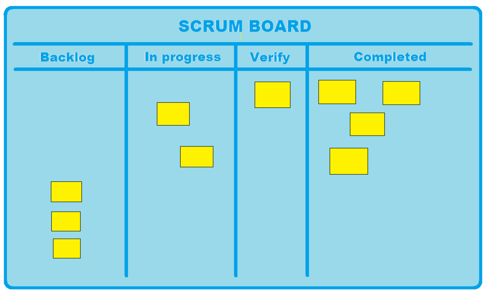

There are many computer-based software engineering tools that can be used as a virtual representation of some scrum tools. Many have integrated these functions as part of their project management software \[PMS\], but Trello is a suitable example for a collaborative representation of most agile artefacts. Trello can provide a way to accommodate Collaboration and Communication, Requirements Engineering, Project Planning and Progress Tracking, and Change Management.

Although Trello can be a suitable PMS for such approaches as lean, it lacks a way to ensure quality assurance for the product that is being developed. In order to compensate for this missing area, the integration of another software or tool maybe be necessary.

Agile Tools
===========

Before getting into the details of how Trello can accommodate for the areas mentioned above, it is recommended to become familiar with the artefacts that are commonly used in the agile methodology.

A task board is a common artefact used in many methods of the agile methodology. They are used by the project team to give an indication on the progress of a task from the current product backlog. This ensures the project team has knowledge of developing the minimal marketing feature in terms of it’s ‘time cycle’ and the project team can make decisions to modify the rate at which a specific tasks is being pulled from the backlog and into completion.

Collaboration and Communication
===============================

*Trello is a collaboration to that organizes your projects into tools* (Trello Inc. n.d.). It does so by organizing your tasks such as it would on a task board. Trello allows collaboration by giving its users the privilege to share their task boards with other users.

Requirements Engineering
========================

Enter tool guides about Requirements Engineering

Project Planning and Progress Tracking
======================================

The task board follow the categorisation of tasks in terms of their progression. The image below shows a standard task board layout. Depending on the project team, the categories can vary for further clarification on the progress of a task. Under each category are a list of tasks that have been selected to be completed during the current sprint. As each task is relatively small and can be done by a single team member, each member is given the opportunity to undertake their desired tasks and relocate these tasks according to what they think which category fits their selected task. Though, it is recommended for the project team to determine whether a task is considered “completed”.

Change Management
=================

Enter tool guides about Change Management

Quality Assurance
=================

Enter tool guides about Quality Assurance

References:
===========

Trello Inc. (n.d.) *What is Trello?* Retrieved May 1, 2016, from http://help.trello.com/article/708-what-is-trello
