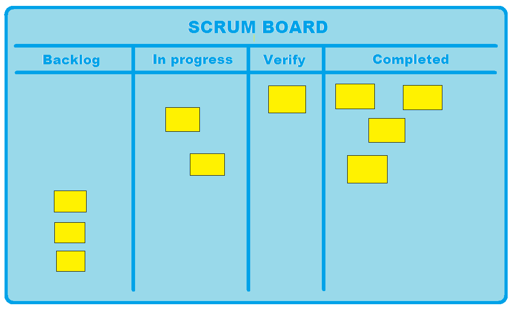
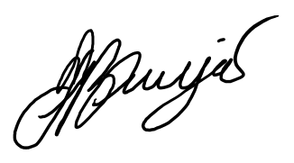

**Team Contract
Project** **Team: “**Very Secret After the meeting” Team.

**Project Team Members:**

|                               |                                                          |
|-------------------------------|----------------------------------------------------------|
| **Member Name (Student ID)**  | **Signature**                                            |
| Miguel Saavedra (13826904)    |  |
| Nitiwat Phachansiri (1319285) |  |
| Tristan Borja (1322097)       |  |
| Vivian Ngo (13830597)         |   |

**Code of Conduct:**

-   Team members shall be honest with the availability of their time.

**Participation:** Each team member will (to a certain extent):

-   Contribute to completing tasks specified in the WBS

-   Attend weekly face to face/video call meetings

-   Contribute to daily standups

-   Support and collaborate with each other when necessary

**Agreed Modes of Communication:**

-   Face to Face meetings

<!-- -->

-   Facebook

-   Google Hangouts for video calls

**Frequencies:**

-   There will be daily stand up posts on Facebook.

-   There will be face to face meetings at least once a week

-   There will be constant communication via facebook messenger

**Mechanisms adopted for work allocation:**

-   We have decided to incorporate the “Sign-up” Agile practice on our Trello storyboard to ensure that each team member will be able to choose what they want to work on.

-   We have also adopted planning poker which will help us realise which tasks require more effort than others. We will use “effort points” with a scale from 1-10.

**Decision Making Process to handle conflict**

-   When we have conflicts we will have to explain why, and will keep voting until we reach a reasonable consensus.

**Team Member Roles**

-   **Tristan**

    -   Milestone Scheduler - Manages Sprints/Phases, Agenda, Deliverables. Plan will be shuffled around if needed

    -   Task Manager - Manages distributing the deliverables and managing Trello board.

-   **Sonic**

    -   Github Manager - Manages the Pull requests and makes sure there are no merge conflicts.

    -   Milestone Scheduler - Plans the next sprint and its deliverables.

    -   Task Manager - Manages distributing the deliverables and managing Trello board.

-   **Miguel**

    -   Chairman - Manages the stand ups and status of the project.
    
    -   Practice Documenter - Observes and records all practices used and it’s effects and deals with updating the Wiki page.
    
    -   Communicator

-   **Vivian**

    -   Practice Documenter - Observes and records all practices used and it’s effects and deals with updating the Wiki page.

    -   Meeting Facilitator - Records all information talked about in the meeting, decides agenda and.keeps the meeting on course
